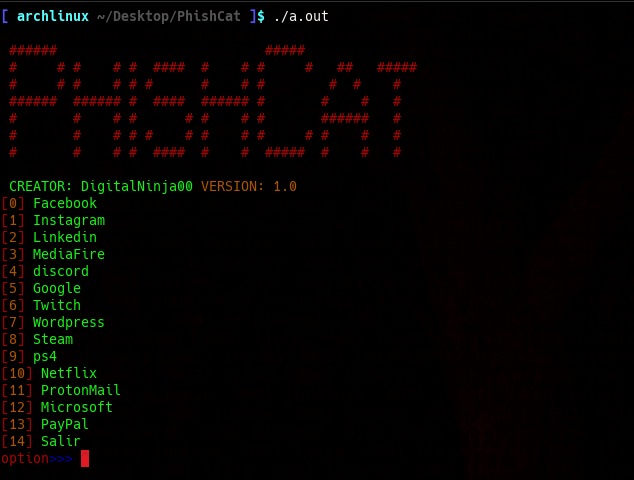

# PhishCat version: 1.0
<center>
    <br>
    <br>
</center>
* 

### Phishing generator for different websites
#### For arch based distros and Debian distros
##You need to run this program with administrator permissions
### For Arch based distros
```
sudo bash arch_install.sh
```
#### For debian based distros
```
sudo bash debian_install.sh

```
### compile, execute and decompress
```
tar -xf sites.tar
g++ compile.cpp -o phishcat
chmod +x phishcat
./phishcat
```
## Authors
@DigitalNinja00
@Cr0w-ui
